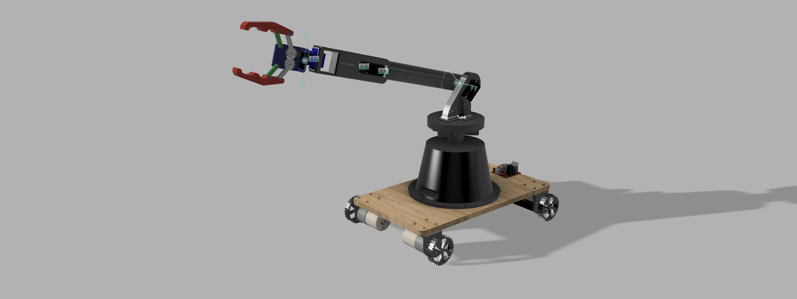

<div align="center">

<br/>

```
░█████╗░██╗░░░██╗████████╗░█████╗░  ░██████╗░██████╗░██╗██████╗░██████╗░███████╗██████╗░
██╔══██╗██║░░░██║╚══██╔══╝██╔══██╗  ██╔════╝░██╔══██╗██║██╔══██╗██╔══██╗██╔════╝██╔══██╗
███████║██║░░░██║░░░██║░░░██║░░██║  ██║░░██╗░██████╔╝██║██████╔╝██████╔╝█████╗░░██████╔╝
██╔══██║██║░░░██║░░░██║░░░██║░░██║  ██║░░╚██╗██╔══██╗██║██╔═══╝░██╔═══╝░██╔══╝░░██╔══██╗
██║░░██║╚██████╔╝░░░██║░░░╚█████╔╝  ╚██████╔╝██║░░██║██║██║░░░░░██║░░░░░███████╗██║░░██║
╚═╝░░╚═╝░╚═════╝░░░╚═╝░░░░╚════╝░  ░╚═════╝░╚═╝░░╚═╝╚═╝╚═╝░░░░░╚═╝░░░░░╚══════╝╚═╝░░╚═╝
```

### 🤖 Point. Tap. Grab. — A Vision-Guided Autonomous Robotic Gripper

<br/>



<br/>

[](https://www.autodesk.com/products/fusion-360)
[]()

</div>

---

## ✦ The Concept

**Autonomous Gripper** is a mobile robotic arm designed to pick up any object you select — just by tapping it on your phone's camera feed.

No joysticks. No manual positioning. No coding required to operate.

> _You see an object through the robot's camera on your phone. You tap it. The robot picks it up — on its own._

---

## ✦ Mechanical Design

The full mechanical system was **designed from scratch in Autodesk Fusion 360**.

Every component — from the wheels to the gripper jaws — was carefully modeled and assembled.

| Component | Description |
|---|---|
| 🚗 **Mobile Base** | Flat 4-wheeled wooden platform carrying all components |
| ⚙️ **Drive Wheels** | Toothed serrated wheels powered by stepper motors |
| 🔄 **Rotating Turret** | Bell-shaped stepper-driven base for full 360° arm panning |
| 🦾 **Articulated Arm** | Two-segment arm with shoulder, elbow, and wrist joints |
| 🤏 **Parallel Jaw Gripper** | Gear-driven gripper with red claw fingers for secure gripping |
| 📷 **Camera Housing** | Integrated mount near the wrist joint for object targeting |
| ⚡ **Electronics Bay** | Onboard enclosure for motor drivers and control board |

All CAD files are included in this repository as `.f3d` and `.f3z` Fusion 360 formats.

---

## ✦ Author

<div align="center">

**Naveen Kumar**
_Mechanical & Robotics Design_

[](https://github.com/naveenkumar-sudoai)

</div>

---

<div align="center">

_Built with 🔩 precision. More updates coming._

**⭐ Star to follow the build journey**

</div>